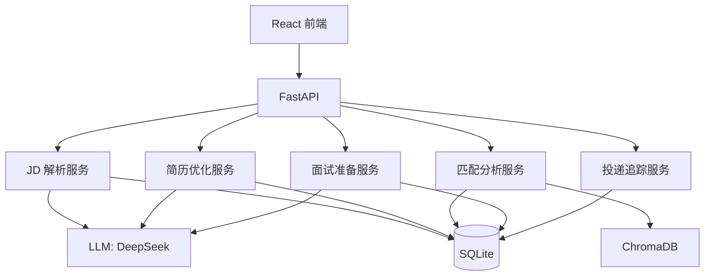

# OfferFlow 求职全流程智能 Agent 系统

> 一个把 JD 解析、匹配分析、简历优化、面试准备和投递追踪串成完整闭环的求职助手。
> 基于 FastAPI + LangGraph + ChromaDB + React 构建，开箱即可运行。

## 项目简介

OfferFlow 面向秋招和社招场景，帮助你从“看到职位”到“拿到 Offer”的整个流程：

1. 粘贴 JD，AI 自动解析公司和岗位要求
2. 选择 JD 与简历，系统给出匹配度评分和差距分析
3. 针对目标 JD 优化简历，并做 ATS 兼容性检查
4. 导入面经，基于简历、JD 和面经生成面试题，支持模拟面试
5. 用看板追踪每一份投递，自动提醒跟进事项并输出统计图表

项目不追求复杂的账号体系和过度设计，先把求职高频动作做到能用、好用的闭环。

## 功能特性

### JD 智能解析

- 粘贴职位描述，由 LLM 提取公司、职位、硬性要求、加分项、技术栈和隐藏信号
- 解析结果自动入库，支持历史记录查看和删除

### 匹配分析

- 本地技能词典识别 JD 和简历中的技能词
- 本地确定性向量化后写入 ChromaDB，按余弦相似度做语义匹配
- 混合评分：语义分 40% + 本地词典分 60%
- 输出匹配度、匹配技能、缺失技能、加分项缺失和投递建议
- 历史匹配结果按分数排序展示

### 简历优化

- 支持粘贴文本，或上传 PDF / Word / Markdown / TXT
- 自动解析简历内容并提取技能
- 针对目标 JD 生成优化稿和改动项
- ATS 兼容性检查，输出优化前后评分对比
- 每次优化保存为新版本，支持版本历史

### 面试准备

- 导入面经文本或文件，自动按相似度去重
- 基于简历 + JD + 面经知识库生成面试题
- 多轮模拟面试：Agent 扮演面试官，回答后给出反馈
- 面试结束后生成整场总结

### 投递追踪

- 投递记录 CRUD，支持关联 JD 和简历
- 看板视图管理状态流转：收藏、已投递、笔试、一面、二面、HR 面、Offer 等
- 状态变化自动记录事件时间线
- 跟进提醒：超期未跟进、即将到来的面试
- Recharts 统计图表：投递漏斗、状态分布、转化率

## 技术栈

| 层 | 技术 |
| --- | --- |
| 后端 | Python 3.13 / FastAPI / SQLAlchemy / Alembic |
| Agent | LangChain / LangGraph / ChromaDB |
| LLM | OpenAI 兼容 API，默认 DeepSeek |
| 前端 | React 19 / TypeScript / Vite / TailwindCSS / Recharts |
| 数据库 | SQLite（默认，可迁移 PostgreSQL） |
| 部署 | Docker / docker-compose |

## 系统架构



## 快速开始

### 1. 配置环境变量

```bash
cp .env.example .env
```

编辑 `.env`，至少填写 `DEEPSEEK_API_KEY`：

```env
DEEPSEEK_API_KEY=你的API密钥
```

### 2. 初始化并启动后端

```bash
uv sync
uv run python run.py
```

后端默认运行在 `http://127.0.0.1:8001`。

### 3. 初始化数据库迁移

```bash
cd backend
uv run alembic upgrade head
```

数据库统一使用项目根目录的 `offerflow.db`。Alembic 初始迁移会自动建表；对已有数据库执行时只会补版本标记，不会重复建表。

### 4. 启动前端

```bash
cd frontend
npm install
npm run dev
```

前端默认运行在 `http://127.0.0.1:5173`，开发模式下 `/api` 由 Vite 代理到后端。

也可以直接运行根目录 `start.bat` 一键启动前后端。

## 测试与检查

```bash
# 后端测试
uv run python -m pytest backend/tests -q

# 前端检查与构建
cd frontend
npm run lint
npm run build
```

## Docker 部署

```bash
docker compose up --build
```

后端服务运行在 `http://127.0.0.1:8001`。`docker-compose.yml` 中的 `DEEPSEEK_API_KEY` 等变量会从项目根目录的 `.env` 读取。

## API 概览

| 方法 | 路径 | 说明 |
| --- | --- | --- |
| `GET` | `/api/health` | 健康检查 |
| `POST` | `/api/v1/jd/parse` | 解析 JD |
| `GET` | `/api/v1/jd/list` | JD 列表 |
| `DELETE` | `/api/v1/jd/{id}` | 删除 JD |
| `POST` | `/api/v1/resume/upload` | 上传简历文本 |
| `POST` | `/api/v1/resume/upload-file` | 上传简历文件 |
| `GET` | `/api/v1/resume/list` | 简历列表 |
| `POST` | `/api/v1/resume/optimize` | 针对 JD 优化简历 |
| `GET` | `/api/v1/resume/{id}/versions` | 简历版本历史 |
| `POST` | `/api/v1/match` | 计算匹配度 |
| `GET` | `/api/v1/match/{id}` | 匹配结果详情 |
| `GET` | `/api/v1/match/rankings` | 匹配排名 |
| `POST` | `/api/v1/interview/articles` | 导入面经 |
| `GET` | `/api/v1/interview/questions` | 获取面试题 |
| `POST` | `/api/v1/interview/simulate/start` | 开始模拟面试 |
| `POST` | `/api/v1/interview/simulate/{session}/answer` | 回答模拟面试题 |
| `GET` | `/api/v1/applications` | 投递列表 |
| `POST` | `/api/v1/applications` | 添加投递记录 |
| `PUT` | `/api/v1/applications/{id}` | 更新投递记录 |
| `DELETE` | `/api/v1/applications/{id}` | 删除投递记录 |
| `GET` | `/api/v1/applications/stats` | 投递统计 |
| `GET` | `/api/v1/applications/reminders` | 跟进提醒 |

完整接口文档见后端启动后的 `http://127.0.0.1:8001/docs`。

## 匹配评分机制

- 本地技能词典：基于预置技能别名表识别 JD 和简历中的技能
- 向量语义：使用本地确定性向量化生成 JD / 简历向量，写入 ChromaDB 后按余弦相似度查询
- 最终评分：`语义分 * 40% + 本地词典分 * 60%`
- DeepSeek 当前不提供 embedding 接口，因此向量化不依赖外网

## 演示数据

后端启动时会自动填充演示数据。如需重置：

```bash
删除根目录 offerflow.db
重新启动后端
```

## 已知限制

- 暂不支持截图 / 图片 OCR：当前 DeepSeek 为纯文本模型，未接入多模态视觉能力
- 当前为单用户模式，没有注册、登录和多用户隔离
- 生产环境目前只 Docker 化后端，前端需要自行构建并托管静态资源

## 项目结构

```text
OfferFlow/
├── backend/
│   ├── alembic/            # Alembic 迁移脚本
│   ├── alembic.ini
│   ├── app/
│   │   ├── agents/         # LangGraph 工作流与 Agent 节点
│   │   ├── api/routes/     # 业务路由
│   │   ├── core/           # 数据库、LLM、向量库
│   │   ├── models/         # SQLAlchemy 模型
│   │   ├── schemas/        # Pydantic 模型
│   │   └── services/       # 业务逻辑
│   └── tests/              # 后端测试
├── frontend/
│   └── src/
│       ├── api/            # API 客户端
│       ├── components/     # 通用组件（含 StatsDashboard）
│       ├── pages/          # 页面
│       └── types/          # TypeScript 类型
├── docker-compose.yml
├── Dockerfile
├── run.py
└── start.bat
```
