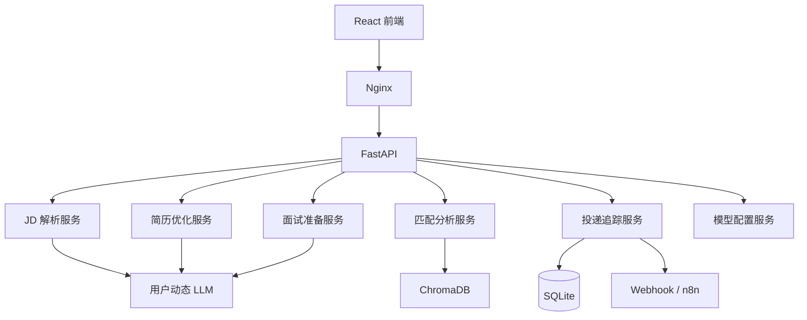

# OfferFlow 求职全流程智能 Agent 系统

> 一个把 JD 解析、简历优化、匹配分析、模拟面试、投递追踪、模型设置和外部提醒串成完整闭环的求职助手。
> 基于 FastAPI + LangGraph + ChromaDB + React 构建，支持用户自带 API Key（BYOK），可 Docker 一键部署。

## 项目简介

OfferFlow 面向秋招、社招和日常求职场景，帮助用户从“看到职位”到“拿到 Offer”：

1. 粘贴 JD 或上传截图，AI 自动解析公司和岗位要求。
2. 选择 JD 与简历，系统给出匹配度、技能差距和投递建议。
3. 针对目标 JD 优化简历，并支持导出 PDF / Word。
4. 导入面经，基于简历、JD 和面经生成面试题，并进行模拟面试。
5. 使用看板追踪每份投递，自动提醒逾期未跟进和即将面试。

## 核心功能

- 注册、登录、JWT 鉴权、用户数据隔离。
- 模型设置：支持 DeepSeek、OpenAI、Moonshot 等模型，用户可配置自己的 API Key。
- JD 智能解析：提取公司、职位、硬性要求、技术栈、隐藏信号。
- JD 与面经截图 OCR：支持 PNG / JPG / JPEG / BMP / WEBP 图片文字识别。
- 简历匹配：本地技能词典 + ChromaDB 语义检索混合评分。
- 简历优化：针对目标 JD 重写简历，输出 ATS 对比和版本历史。
- 简历导出：PDF / Word 一键下载。
- 面试准备：面经导入、面试题生成、多轮模拟面试。
- 投递追踪：看板状态流转、事件时间线、统计图表。
- 批量 JD 匹配：一次粘贴多条 JD，自动解析并排序。
- 主动提醒：定时检查投递进度，通过 Webhook 推送，兼容 n8n。

## 技术栈

| 层 | 技术 |
| --- | --- |
| 后端 | Python 3.13 / FastAPI / SQLAlchemy / Alembic |
| Agent | LangChain / LangGraph / ChromaDB |
| LLM | OpenAI 兼容 API，支持 DeepSeek、OpenAI、Moonshot 等 |
| 前端 | React 19 / TypeScript / Vite / TailwindCSS / Recharts / Zustand |
| 部署 | Docker / docker-compose / Nginx |
| 自动化 | GitHub Actions / n8n |
| 数据 | SQLite（默认，可切换 PostgreSQL） |

## 系统架构



## 快速开始（本地开发）

### 1. 配置环境变量

```bash
cp .env.example .env
```

至少需要配置：

```env
ENCRYPTION_KEY=please-change-this-encryption-key-32chars
JWT_SECRET_KEY=offerflow-secret-key-change-in-production
```

`DEEPSEEK_API_KEY` 不是必须的。首次使用需要用户在“模型设置”页面配置自己的 API Key。

### 2. 启动

```bash
uv sync
uv run python run.py
```

另开终端：

```bash
cd frontend
npm install
npm run dev
```

也可以直接运行：

```bash
start.bat
```

访问：

```text
前端：http://127.0.0.1:5173
后端：http://127.0.0.1:8001
API 文档：http://127.0.0.1:8001/docs
```

## Docker 部署

```bash
cp .env.example .env
docker compose up --build -d
```

访问：

```text
前端：http://localhost
n8n：http://localhost:5678
```

生产环境建议修改：

- `JWT_SECRET_KEY`
- `ENCRYPTION_KEY`
- `REMINDER_WEBHOOK_URL`
- `DEFAULT_USER_PASSWORD`

## 演示账号

默认演示账号：

```text
用户名：demo
密码：demo1234
```

可在 `.env` 中通过 `DEFAULT_USER_NAME` 和 `DEFAULT_USER_PASSWORD` 修改。

## 模型设置（BYOK）

首次上线不配置默认 API Key，用户必须先完成模型设置：

1. 登录后进入 `/settings`。
2. 选择模型预设，例如 DeepSeek、OpenAI、Moonshot。
3. 填写 API Key。
4. 点击“测试连接”。
5. 测试成功后保存。

安全规则：

- API Key 使用 `ENCRYPTION_KEY` 加密存储。
- API Key 不写日志、不返回给前端。
- 前端只显示掩码，例如 `sk-****1234`。
- 每个用户只能读写自己的模型配置。

## 提醒与 n8n

后端会定时检查待跟进投递和即将面试，并推送 Webhook。

配置：

```env
REMINDER_WEBHOOK_URL=https://example.com/webhook
REMINDER_CHECK_INTERVAL_MINUTES=60
```

n8n 已加入 `docker-compose.yml`：

```text
http://localhost:5678
```

可以在 n8n 中创建定时工作流，调用 OfferFlow API 或接收 Webhook，再发送到企业微信、钉钉、邮件等渠道。

仓库提供了基础工作流模板：

```text
n8n/workflows/offerflow-reminders.json
```

可在 n8n 工作流页面导入该文件，并替换其中的 `REMINDER_SERVICE_TOKEN`。

## CI

GitHub Actions 已配置：

- 后端 `pytest`
- 前端 `npm run lint`
- 前端 `npm run build`
- Docker 镜像构建

配置文件：`.github/workflows/ci.yml`

## 测试

```bash
uv run python -m pytest backend/tests -q

cd frontend
npm run lint
npm run build
```

## API 概览

| 方法 | 路径 | 说明 |
| --- | --- | --- |
| `POST` | `/api/v1/auth/register` | 注册 |
| `POST` | `/api/v1/auth/login` | 登录 |
| `GET` | `/api/v1/auth/me` | 当前用户 |
| `POST` | `/api/v1/user/model-config` | 保存模型配置 |
| `GET` | `/api/v1/user/model-config` | 获取模型配置 |
| `POST` | `/api/v1/jd/parse` | 解析 JD |
| `POST` | `/api/v1/jd/ocr` | OCR 识别并导入 JD |
| `POST` | `/api/v1/interview/articles/ocr` | OCR 识别并导入面经 |
| `POST` | `/api/v1/match` | 计算匹配度 |
| `POST` | `/api/v1/match/batch` | 批量匹配 JD |
| `POST` | `/api/v1/resume/optimize` | 优化简历 |
| `GET` | `/api/v1/resume/{id}/export` | 导出简历 |
| `POST` | `/api/v1/interview/simulate/start` | 开始模拟面试 |
| `GET` | `/api/v1/applications/reminders` | 获取提醒 |
| `GET` | `/api/v1/applications/reminders/export` | n8n 提醒导出接口 |

完整接口见后端 `/docs`。

## 简历亮点

- 基于 FastAPI + LangGraph + React 构建求职全流程 Agent，覆盖 JD 解析、语义匹配、简历优化、模拟面试、投递看板。
- 实现注册登录、用户数据隔离、BYOK 模型设置、CI 和一键 Docker 部署。
- 使用 ChromaDB 做本地语义检索，LangGraph 编排多 Agent 工作流，支持 OCR、批量匹配和外部提醒。

## 已知限制

- OCR 依赖 Docker 镜像中的 Tesseract 中文语言包，构建镜像时已安装。
- n8n 容器已加入部署，但工作流需要在 n8n UI 中按实际渠道配置。
- 项目截图和线上访问地址需要在部署后补充。
