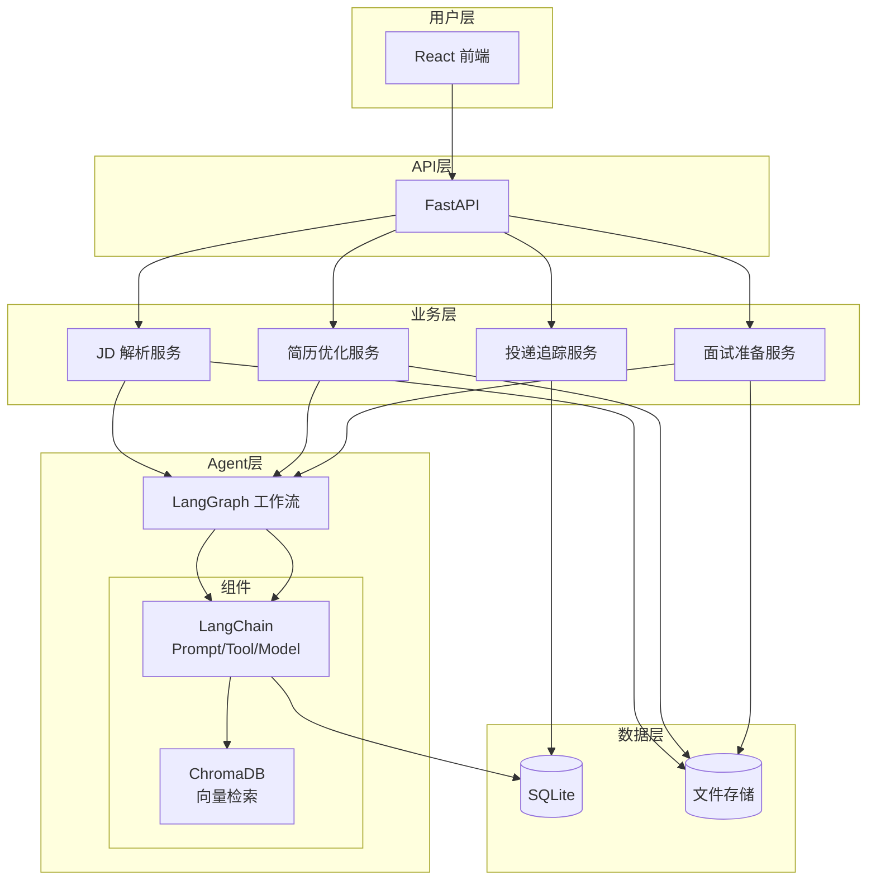

# OfferFlow — 求职全流程智能 Agent 系统

## 实现方案文档 v2.0

---

## 一、项目定位

**一句话：** 一个你自己秋招期间每天都会用的求职辅助工具，也是一个完整上线可访问的 Web 项目，证明你有把产品做出来的工程能力。

**不做：** 自研引擎、炫技式架构、过度设计
**做：** 主流技术栈、完整功能、可测试、可部署

---

## 二、系统架构



---

## 三、技术栈

| 层 | 技术 | 选它而不是... |
|----|------|---------------|
| 后端框架 | **FastAPI** | Flask（无异步原生） |
| 工作流引擎 | **LangGraph** | 自研（没必要造轮子） |
| LLM/工具框架 | **LangChain Core** | 手写 prompt 管理 |
| 向量数据库 | **ChromaDB** | Milvus（太重） |
| 关系数据库 | **SQLite** → **PostgreSQL** | 开发零配置，上线可迁 |
| ORM | **SQLAlchemy + Alembic** | -- |
| 前端框架 | **React + TypeScript** | Vue（你简历上写 React 更通用） |
| 样式 | **TailwindCSS** | -- |
| LLM 接口 | **OpenAI 兼容 API** | 不锁定厂商，可换国产 |
| 部署 | **Docker + docker-compose** | -- |

---

## 四、功能模块

### 模块一：JD 智能解析与匹配

**用户场景：** 看到感兴趣的职位，把 JD 贴进来

**功能：**
- 粘贴 JD 文本 → LLM 解析出：公司/岗位/硬性要求/技术栈/隐藏信号
- 把解析结果和简历做语义匹配 → 输出匹配度评分 + 差距分析
- 批量分析多个 JD → 按匹配度排序，哪些更值得投

**技术实现：**
- `LangGraph` 工作流：JD 解析 → 技能提取 → Embedding → 匹配计算
- 解析结果结构化存入 SQLite
- 简历向量存入 ChromaDB，用余弦相似度算匹配分

### 模块二：简历针对性优化

**用户场景：** 想针对某个 JD 改简历

**功能：**
- 上传简历（PDF / Markdown）→ 解析为结构化数据
- ATS 兼容性检查：关键词密度、格式规范性
- 针对指定 JD 生成优化建议（改什么、怎么改）
- 多版本管理：每次改动保存，可追溯

**技术实现：**
- `PyMuPDF` 解析 PDF，`python-docx` 解析 Word
- LLM 双通道：一个通道保持事实不变，一个通道生成优化建议
- 每个版本存完整快照 + diff

### 模块三：面试准备

**用户场景：** 准备某家公司的面试

**功能：**
- 粘贴/拖入面经 → 自动去重、归类、入库（截图 OCR 暂不支持：当前 DeepSeek 为纯文本模型，未接入多模态视觉能力）
- 基于你的简历 + 目标 JD + 面经知识库 → 生成可能被问到的题目
- 模拟面试：Agent 扮演面试官，你回答，它给反馈

**技术实现：**
- 多格式文档解析：PDF/Markdown/Html/TXT；图片 OCR 暂缓，等待接入支持视觉的多模态模型
- Embedding 去重（相似度 >0.9 合并）
- `LangGraph` 工作流：检索 → 题目生成 → 答案要点

### 模块四：投递追踪看板

**用户场景：** 投了太多家，记不清进度

**功能：**
- 添加投递记录 → 状态流转（已投→简历筛选→一面→二面→HR面→Offer/挂）
- 看板视图：一眼看清所有申请的状态分布
- 自动提醒：3 天没跟进的标记，面试前推送该公司的面经
- 数据统计：投递转化率、各阶段耗时

**技术实现：**
- 纯 CRUD + 状态机
- `react-kanban` 或手写看板组件
- 统计用 SQL 查询 + Recharts 图表

---

## 五、LangGraph 工作流设计

### 5.1 基础模式：所有模块共用

每个模块的 Agent 工作流都遵循这个结构：

```python
from langgraph.graph import StateGraph, END
from typing import TypedDict, Annotated, List
import operator

# 状态定义
class AgentState(TypedDict):
    input: str                    # 原始输入
    parsed: dict                  # LLM 解析结果
    context: dict                 # 上下文/检索结果
    output: str                   # 最终输出
    error: str                    # 错误信息

# 构建图
workflow = StateGraph(AgentState)

# 注册节点
workflow.add_node("parse", parse_node)
workflow.add_node("retrieve", retrieve_node)
workflow.add_node("generate", generate_node)

# 连接边
workflow.add_edge("parse", "retrieve")
workflow.add_edge("retrieve", "generate")
workflow.add_conditional_edges(
    "generate",
    should_retry,               # 判断是否重试
    {True: "parse", False: END}
)
```

### 5.2 三个核心 Workflow

```
JD 分析工作流:    parse_jd → extract_skills → match_resume → generate_report
简历优化工作流:    parse_resume → ats_check → analyze_gap → rewrite → validate_fact
面试准备工作流:    import_article → dedup → classify → embed → retrieve → generate_questions
```

### 5.3 工具函数（@tool）

```python
from langchain_core.tools import tool

@tool
def parse_resume_pdf(file_path: str) -> dict:
    """解析 PDF 简历文件为结构化数据"""
    ...

@tool
def semantic_match(jd_skills: list, resume_skills: list) -> dict:
    """计算技能匹配度"""
    ...

@tool
def search_interview_knowledgebase(company: str, position: str, k: int = 5) -> list:
    """从面经知识库检索相关题目"""
    ...
```

---

## 六、数据模型（核心表）

```sql
-- 用户（简化，不做注册系统 MVP 阶段 hardcode）
CREATE TABLE users (
    id TEXT PRIMARY KEY,
    name TEXT NOT NULL,
    created_at TIMESTAMP DEFAULT CURRENT_TIMESTAMP
);

-- JD 解析结果
CREATE TABLE job_descriptions (
    id TEXT PRIMARY KEY,
    user_id TEXT NOT NULL,
    raw_text TEXT NOT NULL,
    company TEXT,
    position TEXT,
    must_have JSON,              -- ["学历:硕士", "经验:3年+"]
    nice_to_have JSON,
    tech_stack JSON,             -- {"backend":["Python","Go"],"infra":["K8s"]}
    hidden_signals JSON,
    embedding_id TEXT,           -- ChromaDB 向量 ID
    created_at TIMESTAMP,
    FOREIGN KEY (user_id) REFERENCES users(id)
);

-- 简历版本
CREATE TABLE resumes (
    id TEXT PRIMARY KEY,
    user_id TEXT NOT NULL,
    version INTEGER NOT NULL,
    raw_text TEXT NOT NULL,       -- 原始内容
    parsed_json JSON,            -- 结构化解析结果
    source_file TEXT,            -- 源文件名
    created_at TIMESTAMP,
    FOREIGN KEY (user_id) REFERENCES users(id)
);

-- 匹配结果
CREATE TABLE match_results (
    id TEXT PRIMARY KEY,
    jd_id TEXT NOT NULL,
    resume_id TEXT NOT NULL,
    score REAL NOT NULL,              -- 0-100
    skill_match_detail JSON,         -- 技能级匹配明细
    gap_analysis JSON,               -- 差距分析
    suggestion TEXT,                  -- 优化建议
    created_at TIMESTAMP,
    FOREIGN KEY (jd_id) REFERENCES job_descriptions(id),
    FOREIGN KEY (resume_id) REFERENCES resumes(id)
);

-- 面经条目
CREATE TABLE interview_articles (
    id TEXT PRIMARY KEY,
    user_id TEXT NOT NULL,
    company TEXT,
    position TEXT,
    raw_content TEXT,               -- 原文摘要
    questions JSON,                 -- 提取出的题目列表
    tags JSON,                      -- ["算法","系统设计","项目深挖"]
    difficulty TEXT,                -- LLM 自动标定
    embedding_id TEXT,
    source TEXT,                    -- import|share
    created_at TIMESTAMP,
    FOREIGN KEY (user_id) REFERENCES users(id)
);

-- 面试题目
CREATE TABLE interview_questions (
    id TEXT PRIMARY KEY,
    article_id TEXT,
    user_id TEXT NOT NULL,
    question TEXT NOT NULL,
    answer TEXT,                    -- 答案要点
    category TEXT,                  -- 技术/项目/行为
    difficulty TEXT,
    created_at TIMESTAMP,
    FOREIGN KEY (article_id) REFERENCES interview_articles(id),
    FOREIGN KEY (user_id) REFERENCES users(id)
);

-- 投递追踪
CREATE TABLE applications (
    id TEXT PRIMARY KEY,
    user_id TEXT NOT NULL,
    company TEXT NOT NULL,
    position TEXT NOT NULL,
    status TEXT NOT NULL DEFAULT "saved",
    -- saved|applied|online_test|first_interview|second_interview|hr_round|offered|accepted|rejected
    jd_id TEXT,
    resume_id TEXT,
    applied_date DATE,
    next_action TEXT,               -- 下一步要做的事
    next_action_date DATE,          -- 提醒日期
    notes TEXT,
    created_at TIMESTAMP,
    updated_at TIMESTAMP,
    FOREIGN KEY (user_id) REFERENCES users(id),
    FOREIGN KEY (jd_id) REFERENCES job_descriptions(id)
);

-- 投递事件时间线
CREATE TABLE application_events (
    id TEXT PRIMARY KEY,
    application_id TEXT NOT NULL,
    event_type TEXT NOT NULL,        -- status_change|interview_note|follow_up
    from_status TEXT,
    to_status TEXT,
    description TEXT,
    event_date TIMESTAMP NOT NULL,
    created_at TIMESTAMP,
    FOREIGN KEY (application_id) REFERENCES applications(id)
);
```

---

## 七、API 设计

### 返回格式

```json
{
  "success": true,
  "data": {},
  "error": null
}
```

### 接口列表

| 方法 | 路径 | 说明 |
|------|------|------|
| `POST` | `/api/v1/jd/parse` | 解析 JD |
| `GET` | `/api/v1/jd/list` | JD 列表 |
| `DELETE` | `/api/v1/jd/{id}` | 删除 JD |
| `POST` | `/api/v1/resume/upload` | 上传简历 |
| `GET` | `/api/v1/resume/list` | 简历列表 |
| `POST` | `/api/v1/resume/optimize` | 针对 JD 优化简历 |
| `GET` | `/api/v1/resume/{id}/versions` | 简历版本历史 |
| `POST` | `/api/v1/match` | 执行匹配 |
| `GET` | `/api/v1/match/{id}` | 匹配结果详情 |
| `GET` | `/api/v1/match/rankings` | 批量 JD 排名 |
| `POST` | `/api/v1/interview/articles` | 导入面经 |
| `GET` | `/api/v1/interview/questions` | 获取面试题 |
| `POST` | `/api/v1/interview/simulate` | 开始模拟面试 |
| `POST` | `/api/v1/interview/simulate/{session}/answer` | 回答 |
| `CRUD` | `/api/v1/applications` | 投递记录 |
| `POST` | `/api/v1/applications/{id}/events` | 添加事件 |
| `GET` | `/api/v1/applications/stats` | 统计数据 |

---

## 八、目录结构

```
OfferFlow/
├── backend/
│   ├── app/
│   │   ├── __init__.py
│   │   ├── main.py                    # FastAPI 入口
│   │   ├── config.py                  # 配置
│   │   │
│   │   ├── api/
│   │   │   ├── __init__.py
│   │   │   ├── routes/
│   │   │   │   ├── jd.py
│   │   │   │   ├── resume.py
│   │   │   │   ├── match.py
│   │   │   │   ├── interview.py
│   │   │   │   └── application.py
│   │   │   └── deps.py
│   │   │
│   │   ├── core/
│   │   │   ├── database.py            # SQLAlchemy 连接
│   │   │   ├── llm.py                 # LLM 客户端
│   │   │   └── vector_store.py        # ChromaDB 客户端
│   │   │
│   │   ├── models/                    # SQLAlchemy 模型
│   │   │   ├── user.py
│   │   │   ├── jd.py
│   │   │   ├── resume.py
│   │   │   ├── match.py
│   │   │   ├── interview.py
│   │   │   └── application.py
│   │   │
│   │   ├── schemas/                   # Pydantic 请求/响应
│   │   │   ├── jd.py
│   │   │   ├── resume.py
│   │   │   ├── match.py
│   │   │   ├── interview.py
│   │   │   └── application.py
│   │   │
│   │   ├── services/                  # 业务逻辑
│   │   │   ├── jd_service.py
│   │   │   ├── resume_service.py
│   │   │   ├── match_service.py
│   │   │   ├── interview_service.py
│   │   │   └── application_service.py
│   │   │
│   │   ├── agents/                    # LangGraph 工作流
│   │   │   ├── __init__.py
│   │   │   ├── graphs/
│   │   │   │   ├── jd_analysis.py
│   │   │   │   ├── resume_optimize.py
│   │   │   │   └── interview_prep.py
│   │   │   ├── nodes/                 # 自定义节点
│   │   │   │   └── fact_checker.py
│   │   │   └── tools/                 # @tool 工具函数
│   │   │       ├── resume_parser.py
│   │   │       ├── document_parser.py
│   │   │       └── ats_checker.py
│   │   │
│   │   └── utils/
│   │       └── helpers.py
│   │
│   ├── tests/
│   │   ├── test_jd.py
│   │   ├── test_resume.py
│   │   ├── test_match.py
│   │   ├── test_interview.py
│   │   ├── test_applications.py
│   │   └── conftest.py
│   │
│   ├── alembic/
│   ├── requirements.txt
│   └── Dockerfile
│
├── frontend/
│   ├── src/
│   │   ├── App.tsx
│   │   ├── main.tsx
│   │   ├── pages/
│   │   │   ├── Dashboard.tsx
│   │   │   ├── JDAnalysis.tsx
│   │   │   ├── ResumeOptimize.tsx
│   │   │   ├── InterviewPrep.tsx
│   │   │   └── ApplicationTracker.tsx
│   │   ├── components/
│   │   │   ├── Layout.tsx
│   │   │   ├── Sidebar.tsx
│   │   │   ├── MatchCard.tsx
│   │   │   ├── ResumeDiff.tsx
│   │   │   └── KanbanBoard.tsx
│   │   ├── api/
│   │   │   └── client.ts
│   │   └── types/
│   │       └── index.ts
│   ├── package.json
│   ├── tsconfig.json
│   └── tailwind.config.js
│
├── docker-compose.yml
├── Makefile
├── README.md
└── .gitignore
```

---

## 九、迭代计划（3 周）

### Phase 1：骨架 + JD 解析（第 1-5 天）

| 天 | 任务 | 产出物 |
|----|------|--------|
| 1 | FastAPI 项目结构、SQLAlchemy 模型、配置、数据库初始化 | 可启动的后端 |
| 2 | LangGraph 工作流基础：JD 解析图 | JD 文本 → 结构化 JSON |
| 3 | JD 解析 API + 存储 + 列表 | 接口可调通 |
| 4 | React 脚手架、项目结构、Layout + Sidebar | 前端骨架 |
| 5 | JD 解析页面：粘贴框 + 解析结果展示 | 功能闭环 |

### Phase 2：简历 + 匹配（第 6-10 天）

| 天 | 任务 | 产出物 |
|----|------|--------|
| 6 | 简历上传、PDF 解析、Markdown 解析 | 简历可入库 |
| 7 | 简历优化 LangGraph 工作流 | 针对 JD 出优化建议 |
| 8 | 简历优化 API + 前端页面 | 功能闭环 |
| 9 | 匹配工作流（embedding + 语义匹配） | 匹配度评分 + 差距分析 |
| 10 | 匹配排名页面：多 JD 排序展示 | 完整可视化 |

### Phase 3：面试 + 投递追踪（第 11-15 天）

| 天 | 任务 | 产出物 |
|----|------|--------|
| 11 | 面经导入（文本/PDF/截图OCR）+ 去重 | 面经可入库 |
| 12 | 面试题生成 LangGraph 工作流 | 简历+JD+面经 → 题目 |
| 13 | 模拟面试 Agent（多轮对话） | 可交互练习 |
| 14 | 投递追踪 CRUD + 看板前端 | 状态管理闭环 |
| 15 | 统计图表 + 提醒功能 | 分析数据 |

### Phase 4：打磨 + 测试 + 部署（第 16-21 天）

| 天 | 任务 | 产出物 |
|----|------|--------|
| 16 | 测试：JD 解析 + 匹配单元测试 | pytest 覆盖 |
| 17 | 测试：简历优化 + 面试 + API 集成测试 | 测试覆盖主要路径 |
| 18 | 错误处理 + 边界情况 + 前端 Loading/空态 | 体验完善 |
| 19 | Docker 化 + docker-compose 编排 | `docker-compose up` 一键启动 |
| 20 | 生成 demo 数据 + README + 简历措辞 | 可展示 |
| 21 | 最终联调 + bug fix | 可以上线 |

---

## 十、写在简历上

**OfferFlow — 求职全流程智能 Agent 系统**

> 基于 FastAPI + LangGraph + React 构建的多 Agent 协作系统，覆盖 JD 解析匹配、简历优化、面试准备、投递追踪全流程。后端使用 LangGraph 编排工作流，ChromaDB 实现语义检索，SQLite 持久化数据；前端 React + TailwindCSS 提供看板式交互界面。项目已 Docker 化，可在云服务器一键部署上线。

**技术栈：** Python / FastAPI / LangChain / LangGraph / ChromaDB / SQLAlchemy / React / TypeScript / TailwindCSS / Docker

---

## 十一、上线版扩展计划（2026-08-01）

### 目标定义

最终形态不是“功能无限多”，而是一个别人能注册、能试用、能公开访问的项目：前端 + 后端一键 Docker 部署、用户数据隔离、CI 自动测试、README 完整可讲清。

当前最重要的差距：

- `docker-compose.yml` 中前端仍为注释状态，生产环境只能启动后端。
- 当前是单用户模式，没有注册、登录和用户数据隔离。
- 没有 CI，代码质量和部署无法自动验证。
- 缺少简历导出、OCR、主动提醒这类能直接演示的求职功能。

### 阶段一：真正可上线部署（2-3 天）

- 给 `frontend` 增加生产 Dockerfile，用 Nginx 托管静态文件。
- Nginx 将 `/api` 反向代理到后端，避免前端跨域问题。
- 完善 `docker-compose.yml`：前端、后端、数据卷、健康检查、环境变量、一键启动。
- 后端改为生产启动命令，不再使用 `reload=True`。
- 完善 `.env.example`，增加生产密钥、CORS、LLM 配置说明。
- 验证：`docker compose up --build -d` 后，公网 IP 能直接打开页面，注册后的用户可以完成一次 JD 解析。

### 阶段二：注册登录 + 数据隔离（3-5 天）

- 给 `User` 增加密码哈希字段。
- 新增注册、登录、退出、当前用户接口，返回带过期时间的 token。
- 所有业务接口改为必须登录，并把 `user_id` 传入 JD、简历、匹配、面试、投递服务。
- 前端增加登录页、token 保存、请求头、退出按钮。
- 保留一个演示账号，方便秋招期间给面试官直接试用。
- 验证：创建两个账号，互相看不到对方的 JD、简历、投递记录；后端增加认证和数据隔离测试。

### 阶段三：CI + 工程化（2-3 天）

- 增加 GitHub Actions：后端 `pytest`、前端 `lint` 和 `build`、Docker 构建检查。
- 增加基础日志和错误响应规范。
- 根据部署规模决定是否上 PostgreSQL；如果只是个人演示，SQLite 加数据卷足够，不建议一开始就上复杂中间件。
- 验证：推送到 GitHub 后，CI 全绿，别人可以复现构建。

### 阶段四：补 2-3 个高价值业务功能（3-5 天）

建议优先做：

- 简历导出 PDF / Word：把优化后的简历直接下载。
- OCR 截图导入：JD 和面经截图直接识别，解决 README 中已明确的限制。
- 主动提醒：把页面内提醒扩展成邮件或企业微信 Webhook，面试前推送公司和岗位的面经。
- 批量 JD 匹配：一次粘贴多个 JD，按匹配度排序，告诉用户先投哪家。
- 验证：每个功能有对应接口测试，且前端能完成完整操作闭环。

### 阶段五：简历化收尾（1-2 天）

- README 重写：项目简介、架构图、核心功能、部署步骤、演示账号、API 说明、技术难点。
- 增加项目截图和线上地址。
- 把项目能力压缩成 2-3 条简历 bullet：
  - 基于 FastAPI + LangGraph + React 构建求职全流程 Agent，覆盖 JD 解析、语义匹配、简历优化、模拟面试、投递看板。
  - 实现注册登录、用户数据隔离、CI 和一键 Docker 部署。
  - 使用 ChromaDB 做本地语义检索，LangGraph 编排多 Agent 工作流。
- 验证：一个完全不了解项目的人，能按 README 在 10 分钟内启动并试用。

### 实施建议

下一阶段优先做阶段一和阶段二，这两项决定项目能不能算“完整可上线”。业务功能先不加，等部署和账号体系稳定后，再从中挑 2 个做差异化亮点。

---

*文档结束*
